# Snippe PHP SDK

The simplest way to accept payments in Tanzania. Mobile Money, Cards, and QR codes — all in a few lines of PHP.

```php
$snippe = new Snippe('snp_your_api_key');

$payment = $snippe->mobileMoney(5000, '0754123456')
    ->customer('John Doe', 'john@email.com')
    ->send();

echo $payment->reference(); // "9015c155-9e29-..."
echo $payment->status();    // "pending"
```

---

## Table of Contents

- [Installation](#installation)
- [Quick Start](#quick-start)
- [Collecting Payments](#collecting-payments)
  - [Mobile Money](#mobile-money)
  - [Card Payments](#card-payments)
  - [Dynamic QR](#dynamic-qr)
- [Webhooks](#webhooks)
- [Payment Operations](#payment-operations)
  - [Find Payment](#find-payment)
  - [List Payments](#list-payments)
  - [Account Balance](#account-balance)
  - [Retry USSD Push](#retry-ussd-push)
  - [Search Payments](#search-payments)
- [Payment Object](#payment-object)
- [Error Handling](#error-handling)
- [Phone Number Normalization](#phone-number-normalization)
- [Configuration](#configuration)
- [Full Example: Bookstore](#full-example-bookstore)
- [API Reference](#api-reference)
- [Testing](#testing)

---

## Architecture

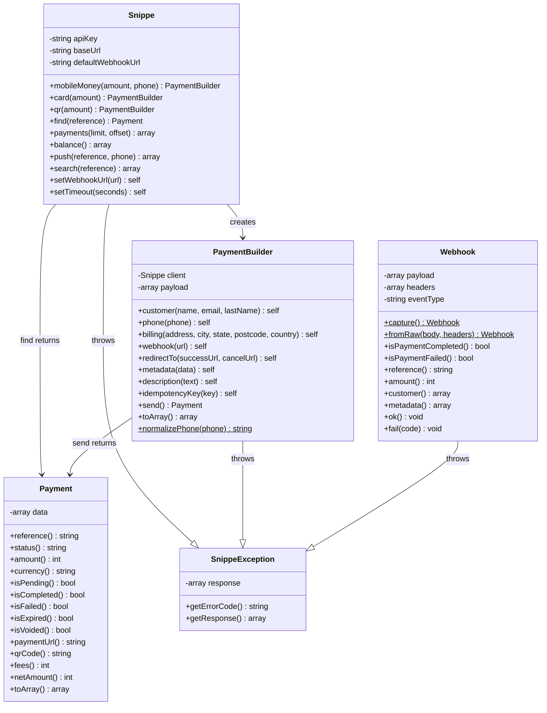

---

## Installation

```bash
composer require snippe/snippe-php
```

**Requirements:** PHP 8.1+, ext-curl, ext-json

---

## Quick Start

```php
<?php
require 'vendor/autoload.php';

use Snippe\Snippe;

$snippe = new Snippe('snp_your_api_key');

// Collect TZS 5,000 via Airtel Money
$payment = $snippe->mobileMoney(5000, '0754123456')
    ->customer('John Doe', 'john@email.com')
    ->webhook('https://yoursite.com/webhook')
    ->send();

echo $payment->reference(); // unique payment reference
echo $payment->status();    // "pending" — USSD push sent to phone
```

That's it. The customer gets a USSD prompt on their phone, enters their PIN, and you get a webhook when it's done.

### How It All Works

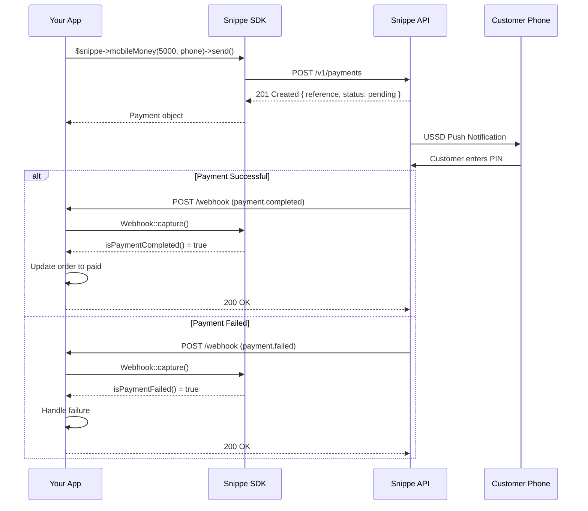

---

## Collecting Payments

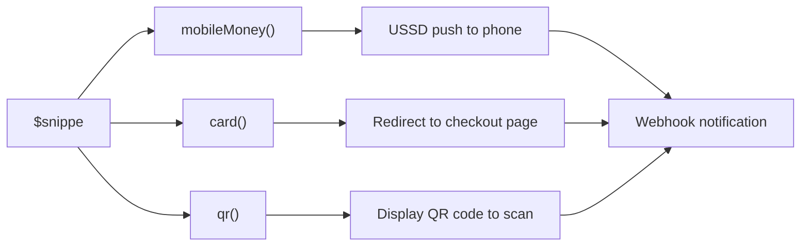

### Mobile Money

Supported: **Airtel Money**, **M-Pesa**, **Mixx by Yas**, **Halotel** (Tanzania)

```php
$payment = $snippe->mobileMoney(5000, '0754123456')
    ->customer('John Doe', 'john@email.com')
    ->send();
```

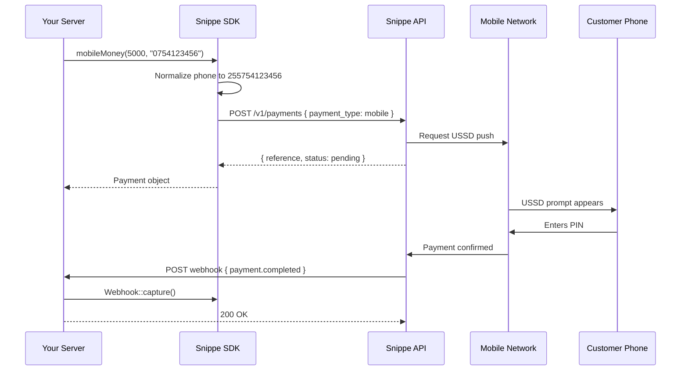

The customer receives a USSD push notification. They enter their PIN to authorize. You get a `payment.completed` or `payment.failed` webhook.

**With all options:**

```php
$payment = $snippe->mobileMoney(5000, '0754123456')
    ->customer('John Doe', 'john@email.com')
    ->webhook('https://yoursite.com/webhook')
    ->metadata(['order_id' => 'ORD-123'])
    ->description('Order from My Shop')
    ->idempotencyKey('order-123-attempt-1')
    ->send();
```

### Card Payments

Supported: **Visa**, **Mastercard**, local debit cards

```php
$payment = $snippe->card(10000)
    ->phone('0754123456')
    ->customer('John Doe', 'john@email.com')
    ->billing('123 Main Street', 'Dar es Salaam', 'DSM', '14101', 'TZ')
    ->redirectTo('https://yoursite.com/success', 'https://yoursite.com/cancel')
    ->send();

// Redirect the customer to the secure checkout page
header('Location: ' . $payment->paymentUrl());
```

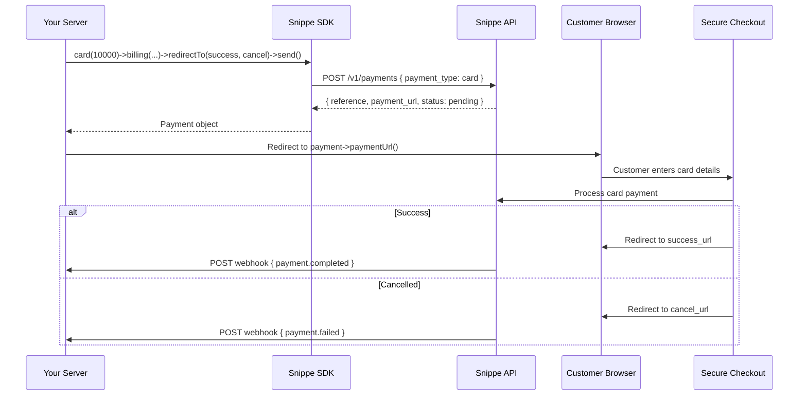

The customer is redirected to a secure checkout page, enters their card details, and is redirected back to your `redirect_url` or `cancel_url`.

### Dynamic QR

Generate a QR code that customers scan with their mobile money app.

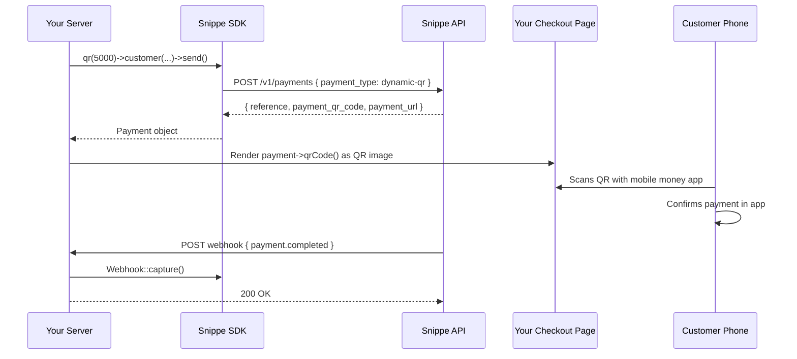

```php
$payment = $snippe->qr(5000)
    ->customer('John Doe', 'john@email.com')
    ->redirectTo('https://yoursite.com/success', 'https://yoursite.com/cancel')
    ->send();

// Render this as a QR image for the customer to scan
$qrData = $payment->qrCode();

// Or redirect to the hosted payment page
$paymentUrl = $payment->paymentUrl();
```

---

## Webhooks

When a payment completes or fails, Snippe sends a POST request to your webhook URL. The SDK makes handling it dead simple.

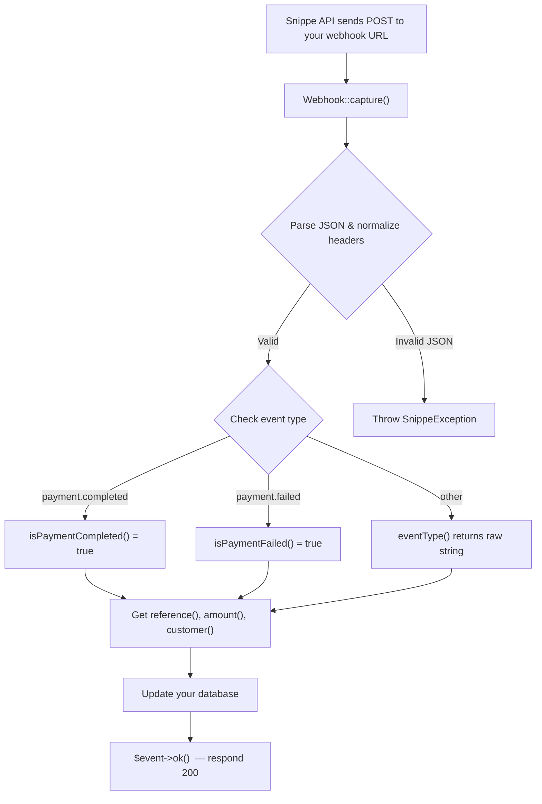

**webhook.php:**

```php
<?php
require 'vendor/autoload.php';

use Snippe\Webhook;

$event = Webhook::capture();

if ($event->isPaymentCompleted()) {
    $ref = $event->reference();
    // Mark order as paid in your database
    // $db->execute("UPDATE orders SET status = 'paid' WHERE payment_ref = ?", [$ref]);
}

if ($event->isPaymentFailed()) {
    $ref = $event->reference();
    // Handle failure
    // $db->execute("UPDATE orders SET status = 'failed' WHERE payment_ref = ?", [$ref]);
}

// Always respond 200 so Snippe knows you received it
$event->ok();
```

**What `Webhook::capture()` does for you:**
- Reads the raw POST body from `php://input`
- Parses JSON safely (throws `SnippeException` on invalid JSON)
- Normalizes headers to be **case-insensitive** (works on Apache, Nginx, PHP-FPM, etc.)
- Extracts the event type from the `X-Webhook-Event` header

### Webhook Data Accessors

```php
$event->eventType();    // "payment.completed" or "payment.failed"
$event->reference();    // payment reference string
$event->status();       // "completed", "failed", etc.
$event->amount();       // amount as integer (e.g. 5000)
$event->currency();     // "TZS"
$event->customer();     // ['first_name' => '...', 'last_name' => '...', 'email' => '...', 'phone' => '...']
$event->metadata();     // your custom metadata array
$event->payload();      // full raw payload as array
$event->rawBody();      // raw JSON string
```

### Webhook Responses

```php
$event->ok();           // respond 200 OK
$event->fail(400);      // respond with error code
```

### Testing Webhooks Locally

Use `Webhook::fromRaw()` to simulate webhook events in your tests:

```php
$body = json_encode([
    'data' => [
        'reference' => 'test-ref-123',
        'status'    => 'completed',
        'amount'    => ['value' => 5000, 'currency' => 'TZS'],
    ]
]);

$event = Webhook::fromRaw($body, [
    'X-Webhook-Event' => 'payment.completed',
]);

$event->isPaymentCompleted(); // true
$event->reference();          // "test-ref-123"
$event->amount();             // 5000
```

---

## Payment Operations

### Find Payment

Check the status of any payment by its reference.

```php
$payment = $snippe->find('9015c155-9e29-4e8e-8fe6-d5d81553c8e6');

echo $payment->status();     // "completed"
echo $payment->amount();     // 5000
echo $payment->currency();   // "TZS"
echo $payment->completedAt(); // "2026-01-25T00:50:44.105159Z"
```

### List Payments

Retrieve all your payments with pagination.

```php
$result = $snippe->payments(limit: 20, offset: 0);

$items = $result['data']['items'];  // array of payments
$total = $result['data']['total'];  // total count

foreach ($items as $item) {
    echo $item['reference'] . ' — ' . $item['status'] . "\n";
}
```

### Account Balance

```php
$balance = $snippe->balance();

$available = $balance['data']['available']['value'];    // e.g. 6943
$currency  = $balance['data']['available']['currency']; // "TZS"

echo "Balance: {$currency} " . number_format($available);
```

### Retry USSD Push

If the customer missed the USSD prompt or it timed out, trigger it again.

```php
// Retry to the original phone number
$snippe->push('payment-reference-id');

// Or send to a different phone number
$snippe->push('payment-reference-id', '+255787654321');
```

### Search Payments

Search for payments by reference. Returns the raw API response as an array. Unlike `find()` which returns a `Payment` object for a known reference, `search()` is useful for looking up payments when you have a partial reference or external reference.

```php
$result = $snippe->search('payment-reference');
```

---

## Payment Object

Every payment method returns a `Payment` object with these methods:

| Method | Returns | Description |
|--------|---------|-------------|
| `reference()` | `?string` | Unique payment reference |
| `status()` | `?string` | `pending`, `completed`, `failed`, `expired`, `voided` |
| `paymentType()` | `?string` | `mobile`, `card`, `dynamic-qr` |
| `amount()` | `?int` | Payment amount |
| `currency()` | `?string` | Currency code (`TZS`) |
| `isPending()` | `bool` | Is status pending? |
| `isCompleted()` | `bool` | Is status completed? |
| `isFailed()` | `bool` | Is status failed? |
| `isExpired()` | `bool` | Is status expired? |
| `isVoided()` | `bool` | Is status voided? |
| `paymentUrl()` | `?string` | Checkout URL (card/QR payments) |
| `qrCode()` | `?string` | QR code data string (QR payments) |
| `paymentToken()` | `?string` | Payment token |
| `fees()` | `?int` | Transaction fees (after completion) |
| `netAmount()` | `?int` | Net amount after fees |
| `expiresAt()` | `?string` | Expiration timestamp |
| `createdAt()` | `?string` | Creation timestamp |
| `completedAt()` | `?string` | Completion timestamp |
| `customer()` | `array` | Customer info |
| `toArray()` | `array` | Full response as array |

You can also access any field dynamically:

```php
$payment->api_version;  // "2026-01-25"
$payment->object;       // "payment"
```

---

## Error Handling

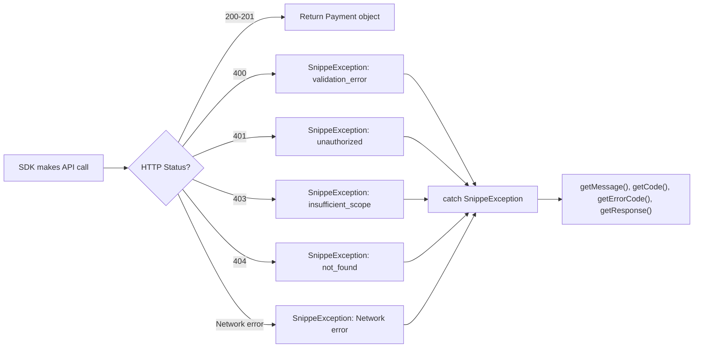

All API errors throw `SnippeException` with the HTTP status code and full response.

```php
use Snippe\SnippeException;

try {
    $payment = $snippe->mobileMoney(5000, '0754123456')
        ->customer('John Doe', 'john@email.com')
        ->send();
} catch (SnippeException $e) {
    echo $e->getMessage();     // "invalid or missing API key"
    echo $e->getCode();        // 401
    echo $e->getErrorCode();   // "unauthorized"
    print_r($e->getResponse()); // full API error response
}
```

**Common errors:**

| HTTP Code | Error Code | Meaning |
|-----------|------------|---------|
| 400 | `validation_error` | Missing or invalid field |
| 401 | `unauthorized` | Bad or missing API key |
| 403 | `insufficient_scope` | API key lacks required scope |
| 404 | `not_found` | Payment not found |

---

## Phone Number Normalization

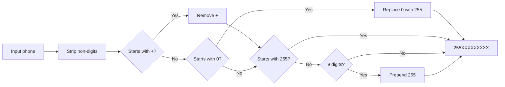

The SDK automatically normalizes Tanzanian phone numbers. All of these work:

```php
->phone('0754123456')       // local format
->phone('+255754123456')    // international with +
->phone('255754123456')     // international without +
->phone('754123456')        // no prefix
->phone('0754 123 456')    // with spaces
->phone('0754-123-456')    // with dashes
```

They all become `255754123456` in the API request.

---

## Configuration

### Default Webhook URL

Set once, applies to all payments:

```php
$snippe = new Snippe('snp_your_api_key');
$snippe->setWebhookUrl('https://yoursite.com/webhook');

// No need to call ->webhook() on every payment
$payment = $snippe->mobileMoney(5000, '0754123456')
    ->customer('John Doe', 'john@email.com')
    ->send();
```

### Timeout

```php
$snippe->setTimeout(60); // seconds (default: 30)
```

### Custom Base URL

For testing against a mock server:

```php
$snippe->setBaseUrl('https://mock-api.yoursite.com/v1');
```

### Idempotency Keys

Prevent duplicate payments on retries. Auto-generated by default, or set your own:

```php
$payment = $snippe->mobileMoney(5000, '0754123456')
    ->customer('John Doe', 'john@email.com')
    ->idempotencyKey('order-123-attempt-1')
    ->send();
```

Same key + same request body = returns cached response (valid for 24 hours).

### Preview Payload

Inspect what will be sent to the API without actually sending:

```php
$builder = $snippe->mobileMoney(5000, '0754123456')
    ->customer('John Doe', 'john@email.com')
    ->metadata(['order_id' => 'ORD-123']);

print_r($builder->toArray());

// Output:
// [
//     'payment_type' => 'mobile',
//     'details' => ['amount' => 5000, 'currency' => 'TZS'],
//     'phone_number' => '255754123456',
//     'customer' => ['firstname' => 'John', 'lastname' => 'Doe', 'email' => 'john@email.com'],
//     'metadata' => ['order_id' => 'ORD-123'],
// ]
```

---

## Full Example: Bookstore

A complete, working bookstore called **Duka la Vitabu** that accepts payments using the Snippe SDK. This was tested live against the real Snippe API.

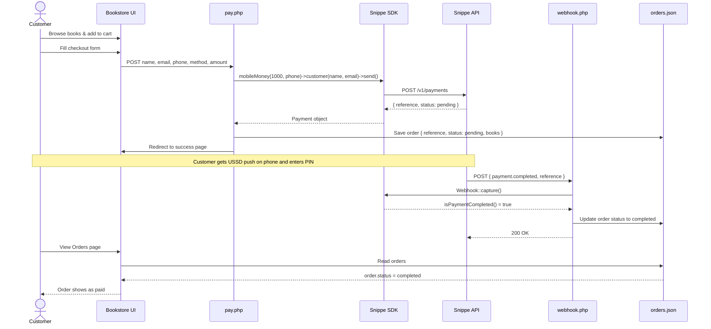

### Project Structure

```
bookstore/
├── composer.json
├── orders.json           ← auto-created, stores orders
├── webhook.log           ← auto-created, logs webhook events
└── public/
    ├── index.php         ← shop, cart, checkout, orders UI
    ├── pay.php           ← payment processing
    └── webhook.php       ← receives Snippe webhooks
```

### composer.json

```json
{
    "require": {
        "snippe/snippe-php": "*"
    }
}
```

### pay.php — Payment Processing

This is the checkout handler. The customer selects a book, fills in their info, and this file charges them using the Snippe SDK.

```php
<?php
session_start();
require 'vendor/autoload.php';

use Snippe\Snippe;
use Snippe\SnippeException;

$snippe = new Snippe('snp_your_api_key');
$snippe->setWebhookUrl('https://yoursite.com/webhook.php');

$name    = $_POST['full_name'];
$email   = $_POST['email'];
$phone   = $_POST['phone'];
$method  = $_POST['payment_method'];  // "mobile_airtel", "mobile_mpesa", "card"
$amount  = (int) $_POST['amount'];    // e.g. 1000 (TZS)

try {
    if (str_starts_with($method, 'mobile_')) {

        // ── Mobile Money ──
        $payment = $snippe->mobileMoney($amount, $phone)
            ->customer($name, $email)
            ->metadata(['order_id' => 'ORD-' . uniqid()])
            ->description('Book order from Duka la Vitabu')
            ->send();

        // USSD push sent to the customer's phone
        header('Location: success.php?ref=' . $payment->reference());

    } elseif ($method === 'card') {

        // ── Card Payment ──
        $payment = $snippe->card($amount)
            ->phone($phone)
            ->customer($name, $email)
            ->billing('N/A', 'Dar es Salaam', 'DSM', '14101', 'TZ')
            ->redirectTo('https://yoursite.com/success', 'https://yoursite.com/cancel')
            ->send();

        // Redirect customer to the secure checkout page
        header('Location: ' . $payment->paymentUrl());
    }

} catch (SnippeException $e) {
    // Show error to customer
    $_SESSION['error'] = 'Payment failed: ' . $e->getMessage();
    header('Location: checkout.php');
}
```

### webhook.php — Receive Payment Notifications

When the customer completes (or fails) the payment, Snippe sends a webhook. This is your entire webhook handler:

```php
<?php
require 'vendor/autoload.php';

use Snippe\Webhook;

$event = Webhook::capture();

if ($event->isPaymentCompleted()) {
    $ref = $event->reference();

    // Update your order in the database
    $db->execute(
        "UPDATE orders SET status = 'paid', paid_at = NOW() WHERE payment_ref = ?",
        [$ref]
    );
}

if ($event->isPaymentFailed()) {
    $ref = $event->reference();

    $db->execute(
        "UPDATE orders SET status = 'failed' WHERE payment_ref = ?",
        [$ref]
    );
}

// Always respond 200 so Snippe knows you received it
$event->ok();
```

### Live Test Results

We ran this bookstore against the real Snippe API:

```
═══════════════════════════════════════════
  Snippe PHP SDK — Live API Tests
═══════════════════════════════════════════

   Get Account Balance        — TZS 5,240
   List Payments              — 48 payments found
   Create Mobile Money        — ref: 083439ef-c4bb-4010-...
   Get Payment Status         — pending, TZS 500
   Webhook Parsing            — payment.completed handled
   Error Handling             — 401 caught correctly

  Results: 6 passed, 0 failed
═══════════════════════════════════════════
```

### Book Catalog

The test bookstore includes these titles at TZS 1,000 each:

| # | Title | Author |
|---|-------|--------|
| 1 | Things Fall Apart | Chinua Achebe |
| 2 | Half of a Yellow Sun | Chimamanda Ngozi Adichie |
| 3 | The Beautyful Ones Are Not Yet Born | Ayi Kwei Armah |
| 4 | Nervous Conditions | Tsitsi Dangarembga |
| 5 | Wizard of the Crow | Ngugi wa Thiong'o |
| 6 | Americanah | Chimamanda Ngozi Adichie |

---

## API Reference

### `Snippe` Class

| Method | Returns | Description |
|--------|---------|-------------|
| `new Snippe($apiKey)` | `Snippe` | Create client with your API key |
| `setWebhookUrl($url)` | `self` | Set default webhook URL for all payments |
| `setTimeout($seconds)` | `self` | Set request timeout (default 30s) |
| `setBaseUrl($url)` | `self` | Override API base URL |
| `mobileMoney($amount, $phone)` | `PaymentBuilder` | Start a mobile money payment |
| `card($amount)` | `PaymentBuilder` | Start a card payment |
| `qr($amount)` | `PaymentBuilder` | Start a QR code payment |
| `find($reference)` | `Payment` | Get payment by reference |
| `payments($limit, $offset)` | `array` | List all payments |
| `balance()` | `array` | Get account balance |
| `push($reference, $phone?)` | `array` | Retry USSD push |
| `search($reference)` | `array` | Search payments |
| `getWebhookUrl()` | `?string` | Get the configured default webhook URL |

### `PaymentBuilder` Class

| Method | Returns | Description |
|--------|---------|-------------|
| `type($type)` | `self` | Set payment type (`mobile`, `card`, `dynamic-qr`) |
| `customer($name, $email, $lastName?)` | `self` | Set customer (auto-splits full name) |
| `phone($phone)` | `self` | Set phone number (auto-normalizes) |
| `billing($address, $city, $state, $postcode, $country?)` | `self` | Billing address (cards) |
| `webhook($url)` | `self` | Set webhook URL |
| `redirectTo($successUrl, $cancelUrl)` | `self` | Redirect URLs (cards/QR) |
| `metadata($data)` | `self` | Custom metadata array |
| `description($text)` | `self` | Payment description |
| `idempotencyKey($key)` | `self` | Custom idempotency key |
| `amount($amount, $currency?)` | `self` | Set amount (default TZS) |
| `send()` | `Payment` | Execute the payment |
| `toArray()` | `array` | Preview the payload |

### `Webhook` Class

| Method | Returns | Description |
|--------|---------|-------------|
| `Webhook::capture()` | `Webhook` | Capture incoming webhook request |
| `Webhook::fromRaw($body, $headers)` | `Webhook` | Create from raw data (testing) |
| `eventType()` | `string` | Event type string |
| `isPaymentCompleted()` | `bool` | Is it a completed payment? |
| `isPaymentFailed()` | `bool` | Is it a failed payment? |
| `reference()` | `?string` | Payment reference |
| `status()` | `?string` | Payment status |
| `amount()` | `?int` | Payment amount |
| `currency()` | `?string` | Currency code |
| `customer()` | `array` | Customer data |
| `metadata()` | `array` | Custom metadata |
| `payload()` | `array` | Full payload |
| `rawBody()` | `string` | Raw JSON string |
| `ok()` | `void` | Respond 200 OK |
| `fail($code?)` | `void` | Respond with error |

### `SnippeException` Class

| Method | Returns | Description |
|--------|---------|-------------|
| `getMessage()` | `string` | Error message from API |
| `getCode()` | `int` | HTTP status code |
| `getErrorCode()` | `?string` | API error code (e.g. `unauthorized`) |
| `getResponse()` | `array` | Full error response from API |

---

## Testing

Run the SDK test suite:

```bash
composer install
./vendor/bin/phpunit
```

```
OK (46 tests, 112 assertions)
```

The test suite covers:
- Phone number normalization (9 formats)
- Payment builder payloads (mobile, card, QR)
- Customer name splitting
- Webhook event parsing (completed, failed, edge cases)
- Header case insensitivity
- Payment response object methods
- Error handling and exception data
- Client configuration

---

## Payment Status Flow

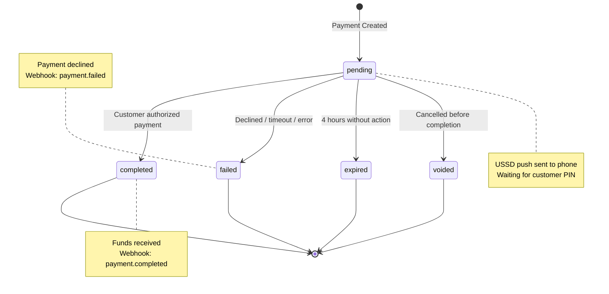

Payments expire after **4 hours** if not completed. Create a new payment if the customer wants to retry.

---

## License

MIT
